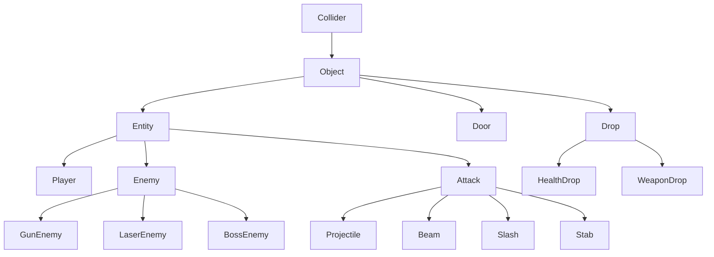
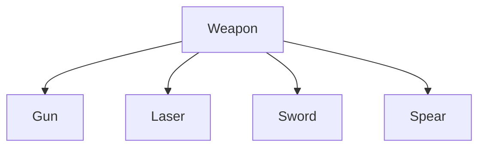
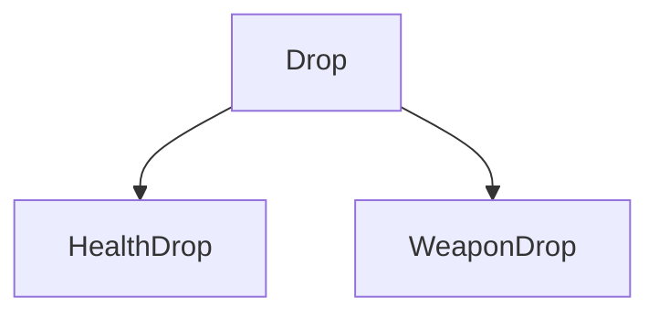
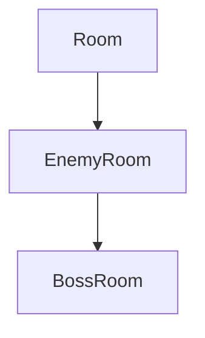

# Bullet-Hell

## Description

  A game inspired by titles such as Soul Knight and The Binding of Isaac. A top-down, mouse-aimed shooter that takes place in a dungeon with randomly generated rooms, accessible one at a time (free access through a room is unlocked after all enemies are eliminated). The last generated room will contain a Boss that must be defeated in order to win the game. The main point of the game is dodging enemy bullets, with HP being the only limited resource and difficult to recover. Killing an enemy has a 10% chance to drop 5-15 HP and 10% to drop a completely random weapon.

## Controls

#### General

- [ ] Exit - Backspace
- [ ] Start (in menu) - Enter
- [ ] Pause - Escape
- [ ] Inventory - Tab (hold) ---> L/R arrow keys to cycle pages if needed
- [ ] Settings - In Main Menu

#### Gameplay

- [ ] Movement - Right click / WASD
- [ ] Fire - Left click
- [ ] Cycle weapons - Scroll wheel

#### Debugging

- [ ] Print all available data to console - i
- [ ] Cycle display collision boxes, hit boxes - h

# Code documentation

## Entity system

The core of the game's entity system is built upon an inheritance chain that progressively adds functionality.

    class Collider 
    {
        Invisible rectangular box (can be made visible by pressing H), used only for collisions that dont need high accuracy (with walls, doors, boxes etc).
    }

    class Object : Collider
    {
        Collider that has a sprite and a texture, used for elements that do not move or suffer any changes during gameplay.
    }

    class Entity : Object
    {
        Object that can be modified through various methods: translation (dedicated speed), rotation, mirroring. 
        Health resource is used to determine when the entity should disappear. 
        Also has a custom convex shape hitBox, used for collisions that ask for higher accuracy (attack hits).
    }

    class Door : Object
    {
        Specialized Object that has an animation and some parts that depend on its positional placement in the Room.
    }

    class Player : Entity
    {
        Entity that is directly controlled by the player. 
        Owns a number of Weapons through composition.
        Manages inventory of picked-up weapons.
    }

    class Enemy : Entity
    {
        Abstract base class for all enemies. 
        Controlled entirely by an algorithm (based on the different elements that are in the room). 
        Its purpose is to kill the player using a Weapon that it also owns through composition.
    }

    class GunEnemy : Enemy
    {
        Enemy armed with a Gun weapon. 
        Uses pathfinding and line-of-sight detection to navigate and hunt the player.
        Spawns Projectile attacks toward the player.
    }

    class LaserEnemy : Enemy
    {
        Enemy armed with a Laser weapon. 
        Simpler behavior focused on direct Beam attacks.
        Can damage anything in its firing line.
    }

    class BossEnemy : Enemy
    {
        Final boss encounter enemy with enhanced capabilities. 
        Dual-armed with both Gun (cannon) and Laser weapons.
        Uses both attack types with tactical offense.
    }

    class Attack (abstract) : Entity
    {
        Specialized Entity that can interact directly with other entities (dealing and/or taking damage) through hitBox collisions, or with other objects with collisionBox. 
        Health resource is used to determine after how many unique hits the Attack disappears.
    }

    class Projectile : Attack
    {
        Ranged Attack that travels in a straight line similar to a bullet. 
        Can potentially pierce and hit more than one target. 
        Can be destroyed by the players melee attacks. 
        Disappears when hitting walls or boxes.
    }

    class Beam : Attack
    {
        Ranged Attack that damages everything in its path at once. 
        Has a built in delay. 
        Passes through walls and boxes.
    }

    class Slash : Attack
    {
        Melee Attack that damages everything in a cone-ish area. 
        Cannot appear inside walls or boxes. 
        Can destroy projectiles.
    }

    class Stab : Attack
    {
        Melee Attack that moves and damages everything in a narrow area. 
        Cannot appear inside walls or boxes. 
        Can destroy projectiles.
    }

    class Drop : Object
    {
        Abstract base class for collectible items that fall from defeated enemies.
        Provides a base interface for applying effects when collected by the player.
    }

    class HealthDrop : Drop
    {
        Drop that restores player health when collected. 
        Heals a random amount between 5-15 HP.
    }

    class WeaponDrop : Drop
    {
        Drop that grants the player a random weapon when collected.
        Weapon is added to the player's inventory for later use.
    }

## Weapon System

Weapons are inventory items that generate `Attack`s.

    class Weapon (abstract)
    {
        Abstract base class defining attack speed, damage, and the attack() interface.
    }

    class Gun : Weapon
    {
        Weapon that spawns Projectile ranged attacks. 
        Is also a default player weapon and used by both normal enemies and bosses.
    }

    class Laser : Weapon
    {
        Weapon that spawns Beam ranged attacks. 
        Can be used by bosses.
    }

    class Sword : Weapon
    {
        Weapon that spawns Slash melee attacks. 
        Is also a default player weapon.
    }

    class Spear : Weapon
    {
        Weapon that spawns Stab melee attacks.
    }

## Drop System

Enemies have a 10% chance to drop items when defeated. There are two types of drops:

    class Drop (abstract)
    {
        Base class for all collectible items. 
        Objects that can be picked up by the player and apply an effect.
    }

    class HealthDrop : Drop
    {
        Restores player health upon collection. 
        Heals a random amount between 5-15 HP.
        Spawn rate: 10% of enemy kills.
    }

    class WeaponDrop : Drop
    {
        Grants a random weapon from the available weapon pool. 
        Weapon is added to player's inventory.
        Spawn rate: 10% of enemy kills.
    }

## Room System

The game world is composed of interconnected rooms.

    class Room
    {
        Base class handling walls, doors, and transitions. 
        Used for starting room.
    }

    class EnemyRoom : Room
    {
        Room that adds enemies and obstacles.
    }

    class BossRoom : EnemyRoom
    {
        EnemyRoom specialized for the Boss encounter.
    }

## Map Generation & Room Factory

The game uses procedural generation for dynamic level layouts:

- **`RoomFactory`**: Factory pattern implementation that creates Room instances based on type (Start, Enemy, Boss). Handles room configuration with appropriate enemies and obstacles.
- **`Level.generateRooms()`**: Uses a randomized depth-first search algorithm to create a connected graph of rooms. Generates between 5 and 14 rooms per level depending on difficulty.
- **Room Connection**: Adjacent rooms are automatically connected with doors, allowing free traversal once enemies in the connected room are eliminated.
- **Room Variety**: Each room type has different characteristics:
  - **Start Room**: Safe starting area with no enemies
  - **Enemy Rooms**: Contain randomized enemy types (GunEnemy, LaserEnemy) and obstacles
  - **Boss Room**: Contains the final BossEnemy encounter

## Player Progression Systems

### Inventory System

- **`Inventory`**: Singleton UI class managing the player's collected weapons
- **Display**: Paginated view showing 6 weapons per page
- **Controls**: L/R arrow keys cycle through pages when inventory is open (Tab hold)
- **Weapon Selection**: Use scroll wheel during gameplay to cycle through collected weapons
- **Capacity**: No hard limit on weapons collected; pagination handles large inventories

### Minimap System

- **`Minimap`**: Real-time map display showing room layout and exploration progress
- **Display**: Visual grid representation of the level's room connections
- **Fog of War**: Rooms are only revealed when visited or neighboring a visited room
- **Current Position**: Shows player's current room in the map
- **Dynamic Updates**: Updates as the player explores and clears rooms

## Game Management & UI

- **`Game`**: The central engine loop. Manages `sf::RenderWindow`, inputs, and the primary state machine.
- **`Level`**: Generates the map layout and manages the grid of `Room`s. Handles background music playback.
- **`ResourceManager`**: Class for loading and storing assets (Textures, Fonts, Sounds) to prevent duplication.
- **`SoundManager`**: Class for managing sound effects and background music. Handles SFX/Music enable/disable toggles.
- **`GUI`**: HUD elements like a health bar.
- **`Utils`**: Static helper functions (math, random generation, coordinate mapping) and some constants.
- **`Settings`, `MainMenu`, `PauseMenu`, `GameOverMenu`**: UI classes handling specific game states.

## Audio System

The game features both sound effects and background music with individual toggles:

- **Background Music**: Plays continuously on loop during gameplay. Automatically pauses when the game is paused and resumes on unpause. Stops and resets when returning to the main menu or when the level ends (win/loss).
- **Sound Effects**: Triggered by gameplay events (shooting, melee attacks, item pickups, UI interactions).
- **Audio Settings**: The Settings menu includes toggles for:
  - **SFX: On/Off** - Controls whether sound effects play
  - **Music: On/Off** - Controls whether background music plays
  - Both settings persist throughout the session and can be toggled at any time

# Resources
<!-- renovate: datasource=github-tags depName=SFML/SFML versioning=loose -->
- [SFML](https://github.com/SFML/SFML/tree/3.0.2) (Zlib)
- https://www.sfml-dev.org/tutorials/3.0/
- https://en.wikipedia.org/wiki/A*_search_algorithm
- https://en.wikipedia.org/wiki/Hyperplane_separation_theorem
- https://dyn4j.org/2010/01/sat/
- https://www.geeksforgeeks.org/cpp/implementation-of-singleton-class-in-cpp/
- https://freesound.org/people/JoelAudio/sounds/77611/
- https://freesound.org/people/nfrae/sounds/691824/
- https://freesound.org/people/MusicLegends/sounds/344312/
- https://www.fesliyanstudios.com/royalty-free-music/downloads-c/8-bit-music/6