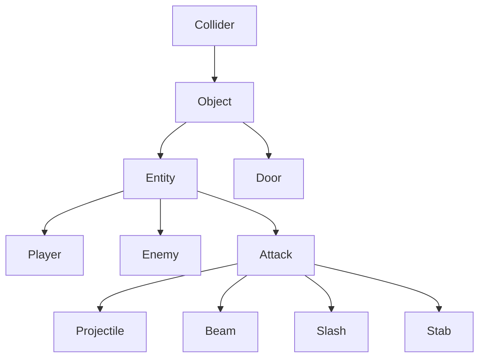
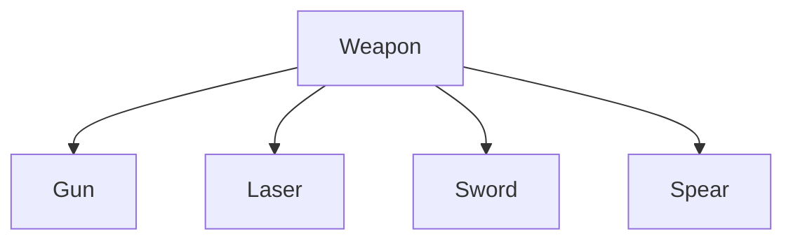
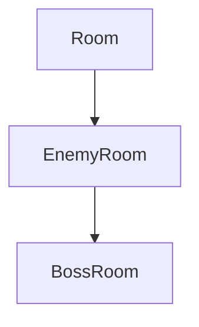

# Class Hierarchy

## Entity system

The core of the game's entity system is built upon an inheritance chain that progressively adds functionality.

    class Collider 
    {
        Invisible rectangular box (can be made visible by pressing H), used only for collisions that dont need high accuracy (with walls, doors, boxes etc).
    }

    class Object : Collider
    {
        Collider that has a sprite and a texture, used for elements that do not move or suffer any changes during gameplay.
    }

    class Entity : Object
    {
        Object that can be modified through various methods: translation (dedicated speed), rotation, mirroring. Health resource is used to determine when the entity should disappear. Also has a custom convex shape hitBox, used for collisions that ask for higher accuracy (attack hits).
    }

    class Door : Object
    {
        Specialized Object that has an animation and some parts that depend on its positional placement in the Room.
    }

    class Player : Entity
    {
        Entity that is directly controlled by the player. Owns a number of Weapons through composition.
    }

    class Enemy : Entity
    {
        Entity that is controlled entirely by an algorithm (based on the different elements that are in the room). Its purpose is to kill the player using a Weapon that it also owns through composition.
    }

    class Attack (abstract) : Entity
    {
        Specialized Entity that can interact directly with other entities (dealing and/or taking damage) through hitBox collisions, or with other objects with collisionBox. Health resource is used to determine after how many unique hits the Attack disappears.
    }

    class Projectile : Attack
    {
        Ranged Attack that travels in a straight line similar to a bullet. Can potentially pierce and hit more than one target. Can be destroyed by the players melee attacks. Disappears when hitting walls or boxes.
    }

    class Beam : Attack
    {
        Ranged Attack that damages everything in its path at once. Has a built in delay. Passes through walls and boxes.
    }

    class Slash : Attack
    {
        Melee Attack that damages everything in a cone-ish area. Cannot appear inside walls or boxes. Can destroy projectiles.
    }

    class Stab : Attack
    {
        Melee Attack that moves and damages everything in a narrow area. Cannot appear inside walls or boxes. Can destroy projectiles.
    }

## Weapon System

Weapons are inventory items that generate `Attack`s.

    class Weapon (abstract)
    {
        Abstract base class defining attack speed, damage, and the attack() interface.
    }

    class Gun : Weapon
    {
        Weapon that spawns Projectile ranged attacks. Is also a default player weapon and used by both normal enemies and bosses.
    }

    class Laser : Weapon
    {
        Weapon that spawns Beam ranged attacks. Can be used by bosses.
    }

    class Sword : Weapon
    {
        Weapon that spawns Slash melee attacks. Is also a default player weapon.
    }

    class Spear : Weapon
    {
        Weapon that spawns Stab melee attacks.
    }

## Room System

The game world is composed of interconnected rooms.

    class Room
    {
        Base class handling walls, doors, and transitions. Used for starting room.
    }

    class EnemyRoom : Room
    {
        Room that adds enemies and obstacles.
    }

    class BossRoom : EnemyRoom
    {
        EnemyRoom specialized for the Boss encounter.
    }

## Game Management & UI

- **`Game`**: The central engine loop. Manages `sf::RenderWindow`, inputs, and the primary state machine.
- **`Level`**: Generates the map layout and manages the grid of `Room`s.
- **`ResourceManager`**: Singleton for loading and storing assets (Textures, Fonts) to prevent duplication.
- **`GUI`**: HUD elements like a health bar.
- **`Utils`**: Static helper functions (math, random generation, coordinate mapping) and some constants.
- **`Settings`, `MainMenu`, `PauseMenu`, `GameOverMenu`**: UI classes handling specific game states.
